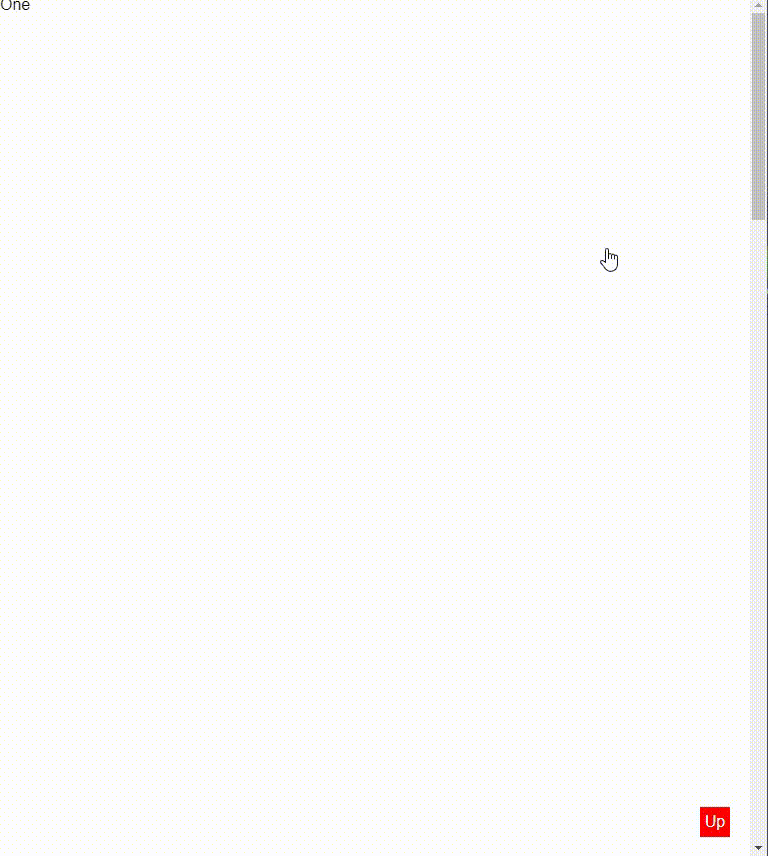
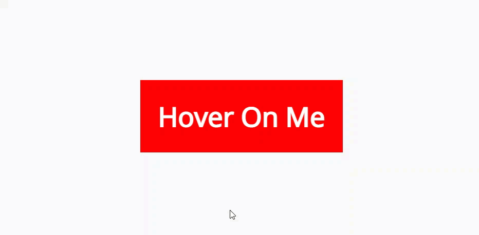
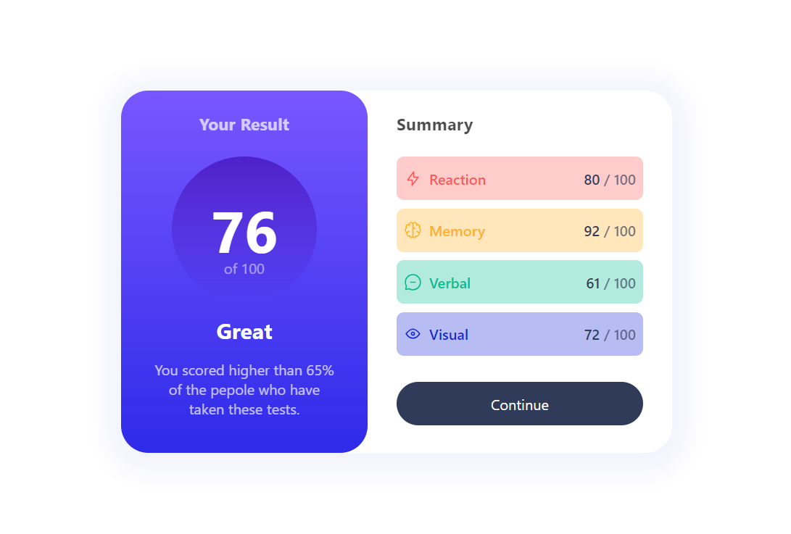
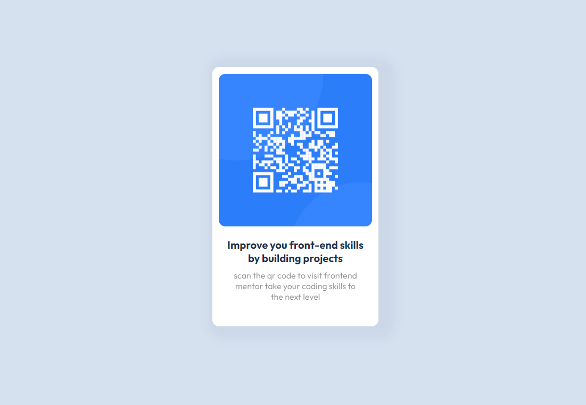
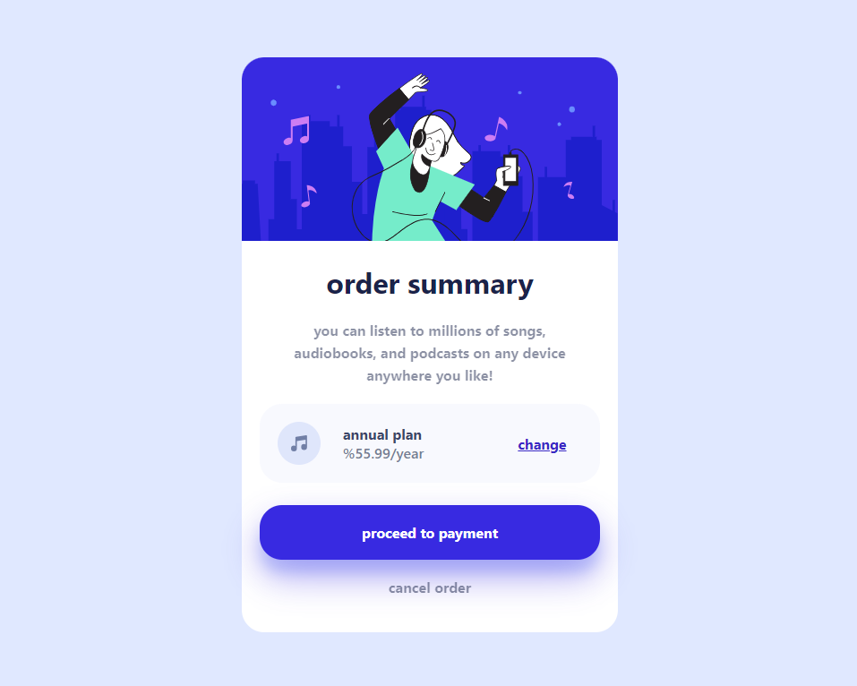
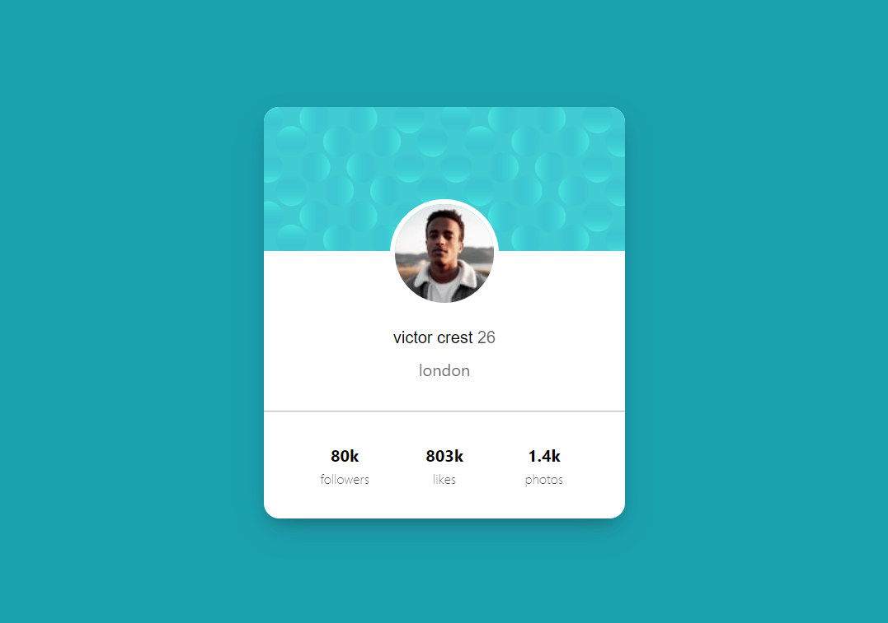
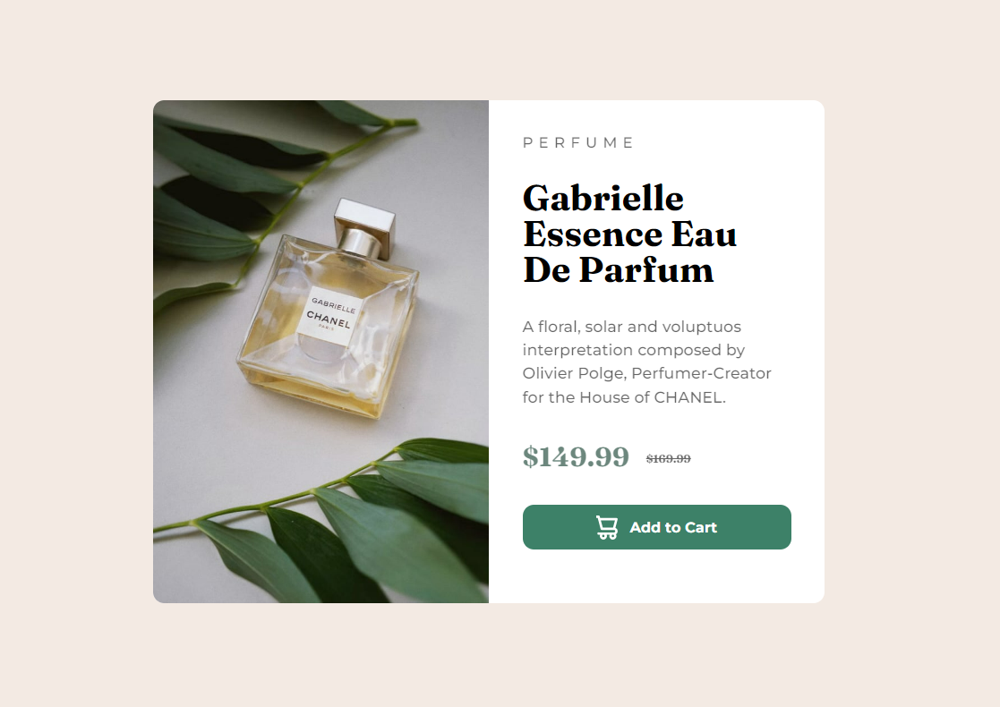
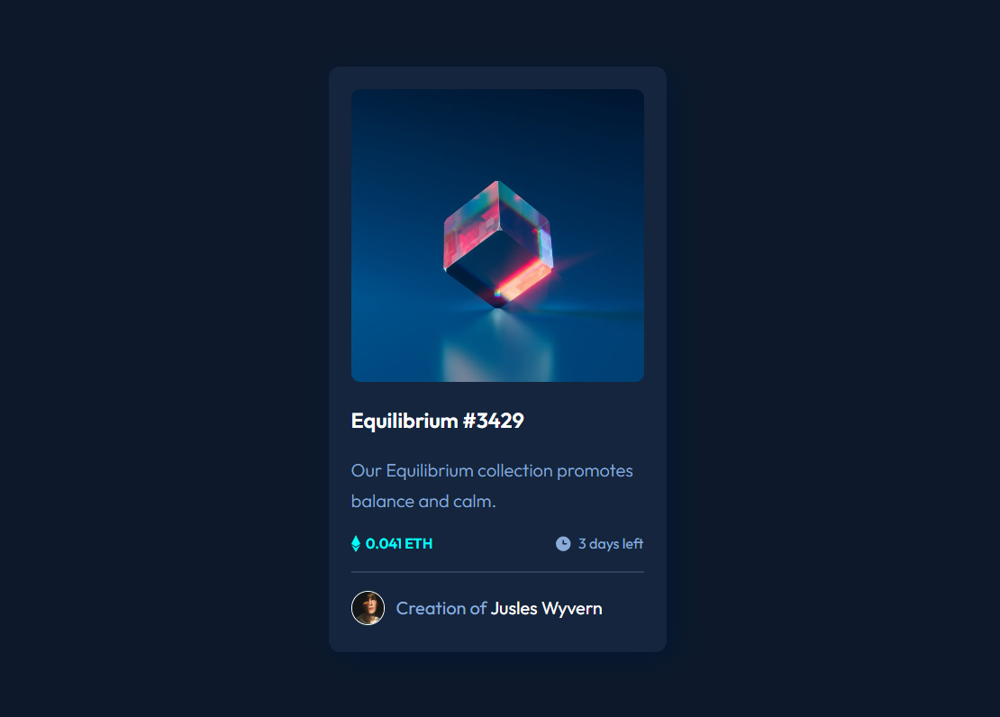
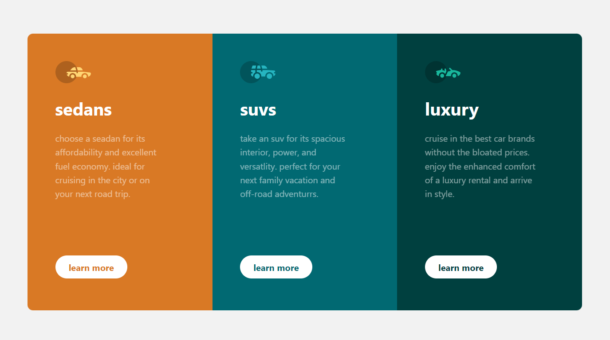
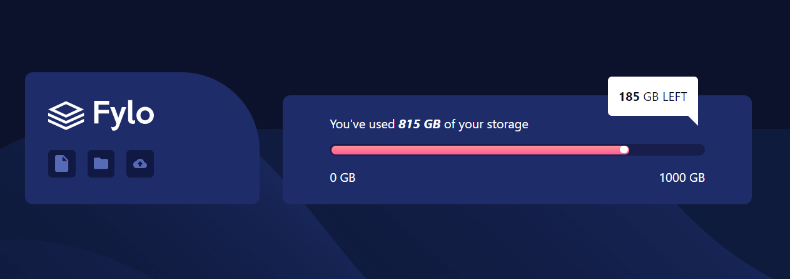

# components

These are HTML  CSS  and JavaScript  Components Training From [Osama Elzero Web site](https://elzero.org/category/challenges/front-end-challenges/#google_vignette)  and [FrontEnd Mentor Website](https://www.frontendmentor.io/) .

### 1- [Make a Scroll To Top Button Using Pure CSS](https://elzero.org/frontend-scroll-to-top-pure-css/) => [Solution](https://github.com/samuadda/components/tree/main/Scroll-To-Top)
#### I Have Used HTML and CSS
* Make a long page with a Scroll To Top button in any shape convenient for you
* When you press the button, it goes up the page smoothly
* Do not use JavaScript at all

### 2- [Hover To Show Tooltip](https://elzero.org/frontend-hover-to-show-tooltip/) => [Solution](https://github.com/samuadda/components/tree/main/Hover-To-Show-Tooltip)
#### I Have Used HTML and CSS
* You should only make a Span element on the entire page to implement the idea
* The Tooltip should appear smooth as in the example
* Only HTML + CSS should be used

### 3- [Results summary component](https://www.frontendmentor.io/challenges/results-summary-component-CE_K6s0maV) => [Solution](https://github.com/samuadda/components/tree/main/results-summary)
#### I Have Used HTML and CSS
* View the optimal layout for the interface depending on their device's screen size
* See hover and focus states for all interactive elements on the page

### 4- [Qr code](https://www.frontendmentor.io/challenges/qr-code-component-iux_sIO_H) => [Solution](https://github.com/samuadda/components/tree/main/QR-code)
#### I Have Used HTML and CSS
* the solution should be as identical as possible to the image provided.

### 5- [Order summary](https://www.frontendmentor.io/challenges/order-summary-component-QlPmajDUj) => [solution](https://github.com/samuadda/components/tree/main/Order-summary)
#### Requirments
* the solution should be as identical as possible to the image provided.
* See hover states for interactive elements

### 6- [Profile card](https://www.frontendmentor.io/challenges/profile-card-component-cfArpWshJ) => [Solution](https://github.com/samuadda/components/tree/main/Profile-card)
#### I Have Used HTML and CSS
* the solution should be as identical as possible to the image provided.

### 7- [Product preview card component](https://www.frontendmentor.io/challenges/product-preview-card-component-GO7UmttRfa) => [Solution](https://github.com/samuadda/components/tree/main/Product-preview-card)
#### I Have Used HTML and CSS
* the solution should be as identical as possible to the image provided.
* See hover states for interactive elements

### 8- [NFT preview card](https://www.frontendmentor.io/challenges/nft-preview-card-component-SbdUL_w0U) => [Solution}(https://github.com/samuadda/components/tree/main/NFT-preview-card)
#### I Have Used HTML and CSS
* View the optimal layout depending on their device's screen size
* See hover states for interactive elements

### 9- [Stats preview card](https://www.frontendmentor.io/challenges/stats-preview-card-component-8JqbgoU62) => [Solution](https://github.com/samuadda/components/tree/main/Product-preview-card)
#### I Have Used HTML and CSS
* the solution should be as identical as possible to the image provided.

### 10- [3-column preview card](https://www.frontendmentor.io/challenges/3column-preview-card-component-pH92eAR2-) => [Solution](https://github.com/samuadda/components/tree/main/3-column-preview-card)
#### I Have Used HTML and CSS
* the solution should be as identical as possible to the image provided.

### 11- [Fylo data storage](https://www.frontendmentor.io/challenges/fylo-data-storage-component-1dZPRbV5n) => [Solution](https://github.com/samuadda/components/tree/main/Fylo-data-storage)
#### I Have Used HTML and CSS
* the solution should be as identical as possible to the image provided.

### 12- [Testimonials grid ](https://www.frontendmentor.io/challenges/testimonials-grid-section-Nnw6J7Un7) => [Solution](https://github.com/samuadda/components/tree/main/Testimonials-grid)
#### I Have Used HTML and CSS utilizing Grid System
* the solution should be as identical as possible to the image provided.

